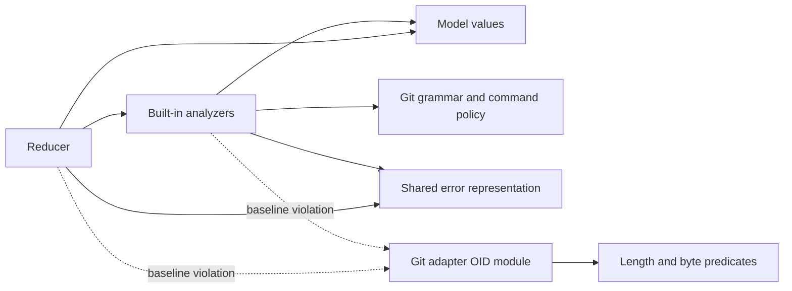

# Layer boundary audit

Baseline: `f138e678802b886603b5504fd789768fef506113`, inspected 2026-09-15.
Tracking: [ENG-464](https://linear.app/polarcoordinates/issue/ENG-464/tighten-existing-layered-architecture-boundaries).
The audit precedes production edits. References below describe the baseline;
the current architecture indexes describe the corrected implementation.
[Verification](layer-boundary-verification.md) records the commits, gates and
reproduction settings.

## Findings and change sequence

| Step | Violated invariant | Evidence | Smallest correction | Regression risk | Boundary evidence |
|---|---|---|---|---|---|
| 1. Value ownership | Reducer and history classification should not depend on an effectful adapter namespace for value semantics. | `reducer.rs` and `analyzers/history.rs` import `operations::git::oid`; its three predicates use only length, ASCII-hex and zero-byte checks. `model/telemetry.rs` imports `metrics::MetricEvent` through an orchestration facade that already re-exports the model type. | Move the existing OID module to `model/git_oid.rs`, preserve its public adapter path by re-export, point reducer/history at the owner; import the canonical model metric type directly. | Changing short/malformed/whitespace OID handling, SHA-256 deletion, retained event bytes, or public paths. | Characterize deletion and retained raw `AppliedCommand` first; run existing OID/history and TestRepo branch lifecycle tests before/after. Policy rejects both original imports. |
| 2. Import enforcement | The documented reducer/analyzer boundary must reject unlisted adapter and ambient dependencies. | `layer_import_policy.rs` omits Git adapters from reducer bans, leaves analyzer dependencies open, parses imports one line at a time, and misses grouped root, relative and inline paths. Its comment incorrectly permits effectful `repo_state`. | Extend the existing textual tests with bounded import handling and explicit permitted directions for reducer, built-in analyzers and their audited pure Git kernels. Forbid model-to-persistence/metrics imports; retain no exception list. | False positives on comments/tests, supplied IO values, or lexical path operations; silent unsupported syntax. | Fixtures for original import, groups, multiline, aliases, inline calls and relative escapes; positive fixtures for legitimate model and kernel paths; run against the whole source tree. |
| 3. Execution locality | The lock boundary should be traceable without following unrelated ingestion and sequencing slices. | `drain_ready_family_sequencer_entries` in `actor_coordinator_seq.rs` calls `side_effect_exec_lock` in `actor_coordinator_ingest.rs`, then the locked drain in `actor_coordinator_drain.rs`. | Move those two unchanged methods into the existing drain module. No whole-file merge. | Changing lock identity/lifetime, ordering, poison-error text or scheduling on the ingestion worker. | Existing held-lock GC, bounded drain concurrency, scheduled checkpoint completion and same-family overtaking tests before/after; inspect body identity and file-size policy. |
| 4. Documentation | Authority, serialization, retry and purity claims must resolve to actual methods. | Successful-exit-only, five global SQLite stores, universally pure model, and actor-before-exec-lock statements conflict with the implementations below. | Replace blanket claims with concrete owners, paths, failure branches and recovery limits; retain historical P9 as a roadmap. | Accidentally blessing broader coupling or promising exactly-once behavior. | Direct source read-back of each corrected claim; existing runtime tests cited at the ownership boundary. |

Normalization of zero OIDs before reduction is **not selected**. `RefChange`
retains observed Git strings; `NormalizedCommand`/`AppliedCommand` serialize
them, history compares raw transitions, and worktree HEAD handling retains
the raw value. Changing these to `Option` or erasing zero representations
would change more than ref-map deletion. Moving the inseparable three syntax
predicates preserves one implementation, with no adapter IO and no new type.

## Observed dependency graph

Arrows mean "depends on". This is the bounded production closure verified by
source inspection, not a whole-crate acyclicity claim.

The pure Git kernel closure is `operations/git/{cli_parser,
command_classification,command_policy}.rs`: respectively 732/1,032,
318/683 and 118/118 production/total lines. The parser and policy table have
no imports; classification imports only that policy table. They parse supplied
strings and perform no IO. Their directory does not make them adapters that
perform effects; retain and guard that explicit boundary. `repo_state` does
perform IO and is not in this closure. Custom `CommandAnalyzer`
implementations registered through `AnalyzerRegistry::register_command` are
outside the built-in source guard's proof.

The top-level directory graph is not a DAG: `git/notes_store.rs` queues notes
then wakes daemon upload through `telemetry_handle::submit_notes`;
`git/trace2_validation.rs` runs a daemon self-check workflow; persistence
initialization can log through observability. These are mixed workflows,
not hidden pure-domain operations. Changing their boundaries is unnecessary
for this correction; removing a notification could delay uploads.

### Purity is narrower than the model directory

`model/clock.rs`, working-log/metric constructors and checkpoint-delivery
creation sample time; checkpoint delivery and authorship serialization can
generate random IDs. Attribution diff processing samples `Instant` and emits
tracing diagnostics, although its attribution calculation is deterministic.
`stream_types` reads a supplied `BufRead`; `stat_snapshot` converts supplied
`fs::Metadata` without opening/statting files. Platform byte conversion in
`jj_observer/paths` likewise does not perform filesystem IO. `GitAiError`
contains adapter error representations; naming it does not execute effects.
Document these distinctions instead of creating abstractions to satisfy the
historical word "pure".

## Core concepts and Git leakage

| Concept | Present responsibility and classification | Future pressure; correction today |
|---|---|---|
| `NormalizedCommand` | Git observation envelope: trace root SID, argv, exit/timing, reflog offsets and source OIDs. Acceptable Git-domain input, not a universal provenance event. | jj operation/change identities and transaction ancestry differ; keep separate observation inputs. Preserve the current representation. |
| `RefChange` | Exact observed Git reference old/new strings, including zero-OID representation. Acceptable Git-domain fact. | Bookmarks, multiple targets and absent states may require another input shape. Move only shared OID syntax now. |
| `FamilyState` | Actor-owned applied sequence, refs, worktrees, errors and watermarks. Causal ordering is domain-level; the contained maps and family key are Git-specific. | Other VCS state/operation graphs need their own evidence model. No generic family framework. |
| `WorktreeState` | Derived Git HEAD/branch/detached state and last update time. Acceptable Git projection, not authority for historical transitions. | jj workspace/change identity is not detached HEAD. Retain the current projection. |
| `AppliedCommand` | Sequenced observation plus interpretation. The causal association is domain-level; its payload is Git-domain and does not prove effect success. | A future common causal envelope needs real consumers first. No rewrite. |
| `SemanticEvent` | Git interpretation: commits, refs, rebase/reset/stash and transport. Domain policy for Git attribution, not a VCS-neutral event vocabulary. | jj abandon/rebase/change evolution is not interchangeable with Git command names. Keep explicit Git semantics. |
| `AnalysisResult` | Classification, interpreted events and confidence. Confidence/evidence separation is domain-level; enum contents are Git-specific. | Reuse the judgment pattern if useful, without forcing shared event types. |

## Measured coordinator boundaries

All twelve files extend **one `ActorDaemonCoordinator`** declared in
`actor_types.rs:187-266`; none independently owns the fields it accesses.
`FamilyState` belongs to the family actor. Baseline: 4,536 physical lines,
128 `fn` declarations (including tests/guards), no file above 600.

State in the table means coordinator fields managed/read by the slice.
Caller lists identify principal production callsites. All paths are under
`src/operations/daemon/` unless qualified.

| `actor_coordinator_` slice | LOC / fn | Responsibility and state | Callers | Dependencies and side effects |
|---|---:|---|---|---|
| `base` | 499 / 22 | Construction, weak self-registration, lifecycle, recovery, GC, pending-edit tracking; coordinator flags, caches/maps and worker handles. | Lifecycle, sockets, trace/ingest/drain, outbox/sweep/commit workers. | Tokio, persistence fallback handles, repository/path/timestamp reads, transcript messages and timed recovery polling. |
| `control` | 247 / 6 | Status/watermarks and completion waits; reads ingress/sequencer/effect state. | Control dispatch, checkpoint admission. | Coordinator/GitBackend, fences/drains, transcript and telemetry flush. |
| `control_requests` | 363 / 1 | Wire dispatch and Bash session lifecycle; owns mutations of coordinator Bash session map. | `client_helpers::dispatch_control_request`. | Control/query/fences/worktree, Bash DB, health/jj control, JSON, telemetry/CAS, shutdown admission. |
| `drain` | 508 / 7 | Causal checkpoint admission, scheduled drains and effect execution; sequencer, scheduled-drain map, semaphore and effect guard. | Query, seq, scheduler tasks. | Family routing, checkpoint/replay/effects, tasks/oneshot/semaphore, panic handling and completion logging. |
| `fences` | 158 / 7 | Admission/restart/shutdown fences; flags/counters plus actionable queue/inflight state. | Lifecycle, control, query. | Queue/trace visibility, notifications and async drain/wait. |
| `ingest` | 325 / 7 | Trace admission, read-only filtering, root metadata/start offsets; ingress/queue counters; unrelated exec-lock accessor. | Sockets, trace, health, control, checkpoint drain; seq for lock. | Parsing, cached/path/common-dir/reflog capture, mpsc, notifications. Latency-sensitive. |
| `query` | 213 / 6 | Mutating normalization, root cancellation, command routing and checkpoint admission/dedup; normalizer/root/admission state. | Trace worker, control, outbox worker. | GitBackend/normalizer, sequencer, snapshots, stream notification, oneshot. Name is procedural, not read-only responsibility. |
| `rewrites` | 280 / 5 | Rewrite detection/application and timestamp snapshot tasks; snapshot handles and pending rebase state. | Side effects, query/drain, commit effects. | Git/rewrite engine, working-log rename/conflicts, metrics and blocking timestamp tasks. |
| `seq` | 567 / 22 | Root slots, ordered entries, drain entrypoint, prior-root fences and recent diagnostics; sequencers, replay/error maps and log lock. | Query/drain/control, Git-operation effects. | Path canonicalization, trace classification, tasks, filesystem completion logs and semantic diagnostics. |
| `side_effects` | 582 / 10 | Event dispatch, failure/conflict handling and pending rebase/cherry-pick state. | Drain. | Git/rewrite/commit/transport effects, config allowlist, worktree state and debug/test environment. |
| `trace` | 498 / 20 | Connection/root lifecycle, sequence accounting and ordered worker; ingress state/counters plus worker-local pending map. | Lifecycle, sockets, ingest/query/control. | Tokio mpsc/tasks, parsing, ingestion, GC and shutdown. |
| `worktree` | 296 / 15 | Pending rebase/cherry-pick/no-commit/squash maps plus HEAD/pathspec parsing. | Control, drain/rewrites, commit/Git effects. | Git root/path resolution, Mutex mutations and argv/ref helpers. |

Whole merges rejected: seq+drain = 1,075 lines; effects+rewrites = 862;
control+requests = 610. Ingest+query fits at 538 but combines hot admission
with slower async routing; rewrites+worktree fits at 576 but mixes execution,
timestamp jobs and state access. No demonstrated ownership improvement.
Moving only the two lock/drain methods reduces the entrypoint→lock→drain
implementation traversal from three files to one, without changing call edges
or state ownership. Existing tests pin held-lock identity during GC, bounded
concurrent draining, scheduled checkpoint completion and same-family ordering.

## Documentation claims checked against implementation

| Baseline claim | Evidence and correction | Regression avoided / verification witness |
|---|---|---|
| Effects require exit code zero. | `actor_coordinator_side_effects.rs::handle_failed_command` preserves failed rebase/cherry-pick continuation and permits supported checkout/stash/squash conflicts. | A blanket success gate loses conflict attribution; checkout/stash/squash conflict tests in the integration suite. |
| Reflog offsets are exact command-start authority. | `actor_coordinator_ingest.rs` captures asynchronously; `ref_cursor/enrichment.rs::initialize_from_command_reflog_start_offsets` treats late hints differently from established cursors. | Avoid skipping a command's own entry; `ref_cursor/tests_commit.rs` cold/late-ingress cases. |
| Actor reduction precedes exec locking; effects are once-only. | Lock acquisition surrounds routing, reduction and effects; entries are removed from an in-memory queue before execution, and errors are reported without generic durable replay. | Avoid interleaved checkpoints or treating sequence as effect completion; coordinator drain/GC/fence tests. |
| Daemon logs retry, and identical checkpoints are idempotent upserts. | `telemetry_worker/daemon_log_upload.rs` drops dispatched failures; notes/metrics retain bounded retry queues. `checkpoint_outbox_worker.rs` retries deliveries; `checkpoint.rs::execute_resolved_checkpoint` deduplicates durable delivery IDs. | Avoid unsafe content-based replay promises; upload-queue, outbox and delivery-dedup tests. |
| Local notes always win over cache and queue. | `notes_db.rs::cache_synced_notes` protects local rows; HTTP queue `UPSERT_NOTE_SQL` replaces content on conflict. | Preserve backend-specific behavior; cache-import and retry-state tests. |
| Five SQLite stores all use global mutex handles. | Streams uses injected `Arc<Mutex<Connection>>`; jj journal/intent have explicit connection ownership. Checkpoint outbox is filesystem-backed. | Distinguish process locks, database transactions and separate jj evidence; store migration/concurrency tests. |
| Every working-log mutation and CLI migration is family-ordered. | `commands/status.rs` can prepare directories via `working_log_for_base_commit`; migrations/cache imports run in separate processes, and notes sync can write another family. | Avoid promising destination exclusivity; caller inspection and journal lock/cache tests. |
| All model code and shared errors are pure; only analyzers classify. | Ambient model constructors, diagnostics and supplied readers remain; shared errors carry adapter error values. Reducer branch inference and effect-side rewrite decisions remain outside analyzers. | Avoid unrelated API/error/constructor rewrites; bounded policy plus reducer/analyzer tests. |

The corrections change documentation, not these runtime behaviors. The five
active documents were reconciled with these methods; P9 remains historical.
