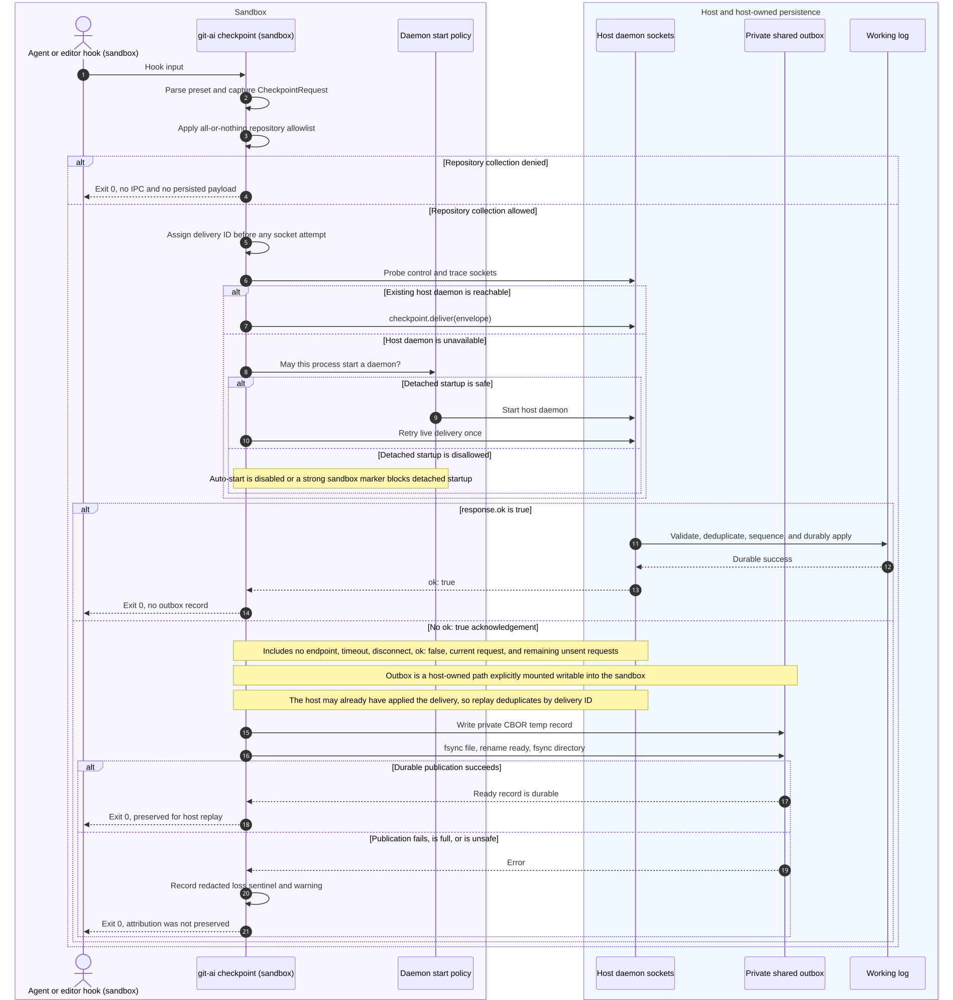
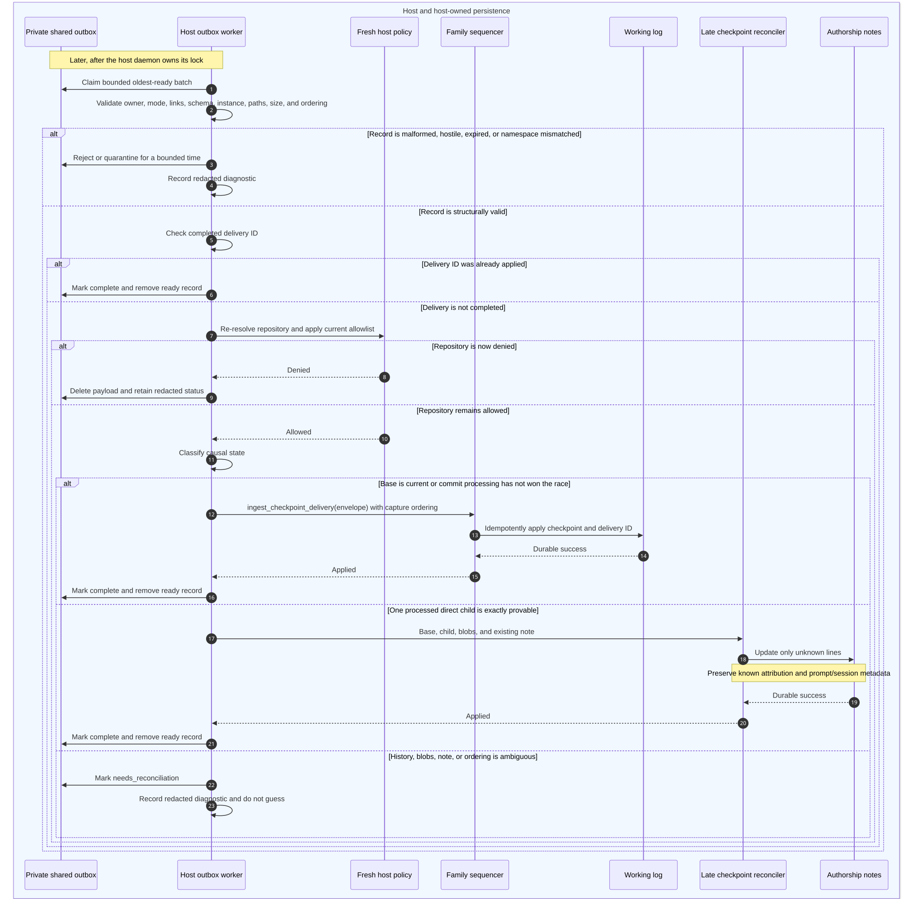

# Sandbox Checkpoint Continuity Flows and Examples

Status: implementation companion. The branch implements these paths in the
phases defined by the design; production availability depends on the phase
currently merged.

This document makes the communication boundary in the
[sandbox checkpoint continuity design](./2026-07-23-sandbox-checkpoint-continuity-design.md)
concrete. The editable Mermaid sources are:

- [delivery and durable fallback](../architecture/diagrams/sandbox-checkpoint-continuity-sequence.mmd)
- [host replay and reconciliation](../architecture/diagrams/sandbox-checkpoint-replay-sequence.mmd)

## Delivery and durable fallback



## Host replay and reconciliation



## Communication boundary

- The sandbox process prepares and authorizes the checkpoint.
- A reachable host daemon is always preferred, even when sandbox environment
  markers are present.
- The shared outbox is used only when live delivery cannot be acknowledged.
- The host daemon distrusts the outbox record: it revalidates ownership,
  schema, instance identity, paths, size, ordering, and repository policy.
- Valid records re-enter the same family sequencer as live checkpoints.
- Hook exit code `0` means "do not break the agent operation." It does not by
  itself mean attribution was preserved; preservation requires a daemon
  acknowledgement or durable outbox publication.

## Happy path 1: the host daemon is already reachable

Example state:

```text
Sandbox markers: CODEX_SANDBOX=seatbelt, CODEX_SANDBOX_NETWORK_DISABLED=1
Repository: /work/api
Collection policy: /work/api is allowed
Host control and trace sockets: reachable
Edited file: /work/api/src/lib.rs
```

Flow:

1. The hook invokes `git-ai checkpoint` inside the sandbox.
2. The CLI captures `src/lib.rs`, its base commit, agent metadata, and a unique
   delivery ID.
3. The client allowlist accepts `/work/api`.
4. The CLI probes the existing host sockets before consulting sandbox markers.
5. The host daemon accepts the delivery, puts it through the `/work/api` family
   sequencer, and durably appends one checkpoint carrying the delivery ID.
6. The daemon returns `ok: true`; the hook exits `0`.

Outcome:

- No daemon is spawned inside the sandbox.
- No outbox record is written.
- Exactly one material checkpoint is visible.

## Happy path 2: delivery is deferred and replayed

Example state:

```text
Sandbox marker: CODEX_SANDBOX=seatbelt
Repository: /work/api, allowed at capture and import
Host daemon: unavailable
Delivery ID: 019f-example-7c2a
Batch: hook-42, ordinal 1
Captured base: abc123
```

Flow:

1. The CLI prepares and authorizes the exact checkpoint.
2. The socket probe fails and the start policy refuses detached startup because
   the process would create a sandbox-inherited daemon.
3. The CLI writes a private CBOR record, `fsync`s it, atomically publishes it,
   and `fsync`s the queue directory.
4. Durable publication succeeds, so the hook exits `0`.
5. A host daemon starts later. Its worker claims the record, verifies that the
   producer and host share the expected user, daemon instance, repository path,
   and allowlist, then submits it to the normal family sequencer.
6. Checkpoint application durably stores delivery ID `019f-example-7c2a`.
7. The worker marks the outbox record complete and removes it.

Outcome:

- The captured source snapshot survives temporary daemon unavailability.
- Replay does not introduce a second checkpoint-processing implementation.
- Queue health briefly reports one pending record, then zero.

## Non-happy path 1: collection is denied

Example: `allowed_repositories` is empty, which is the fork's default.

Outcome:

1. The CLI rejects the hook invocation before socket delivery or persistence.
2. No source content, command metadata, path, or session identifier enters the
   outbox.
3. The hook exits `0` with the existing collection-policy message.

This remains all-or-nothing when one hook produces requests for several
repositories: one denied repository prevents every request in that invocation
from being sent or persisted.

## Non-happy path 2: the daemon applied the checkpoint but the response was lost

Example: the daemon durably appends delivery ID `019f-example-7c2a`, but the
client times out before reading `ok: true`.

Outcome:

1. The client cannot prove acknowledgement, so it publishes the same delivery
   ID to the outbox.
2. During import, the working log already contains that delivery ID.
3. The importer treats the record as completed and removes it without
   appending another checkpoint.

This is why `trace_id` is insufficient: one hook can produce several requests,
so deduplication needs a request-level delivery ID.

## Non-happy path 3: the outbox cannot make the record durable

Examples:

- the queue reached its byte or record limit;
- the filesystem returns `ENOSPC`;
- file `fsync`, atomic rename, or directory `fsync` fails; or
- the derived queue root is a symlink or owned by another user.

Outcome:

1. The CLI does not describe the checkpoint as preserved.
2. It emits a redacted warning and updates a redacted loss sentinel.
3. It still exits `0` so the editor or coding agent operation is not broken.
4. No heuristic later claims that the missing checkpoint was recovered.

This is an explicit attribution loss, not a successful fallback.

## Non-happy path 4: policy changed before import

Example: `/work/api` was allowed when captured, but the host configuration
excludes it before the daemon imports the record.

Outcome:

1. Host-side `Config::fresh()` denies the repository.
2. The payload is removed rather than applied.
3. Only a redacted denial status remains.

The producer's authorization is not trusted indefinitely.

## Non-happy path 5: sandbox and host do not share a repository namespace

Example:

```text
Sandbox path: /workspace/api
Host path: /Users/developer/work/api
Shared outbox: visible to both
Path mapping: not configured or provable
```

Outcome:

1. The host can read the record but cannot prove that `/workspace/api` is the
   intended host repository.
2. The importer marks it `unsupported_namespace`.
3. It does not guess using a remote URL or a nearby repository.

An explicit outbox path solves queue visibility only; it does not solve
identity, configuration, or repository-path mapping.

## Non-happy path 6: the commit won the race

Direct, provable case:

1. The delayed record names base `abc123`.
2. Current commit `def456` is the direct child of `abc123`.
3. The relevant committed blobs exactly match the captured post-edit snapshot.
4. An existing authorship note has unknown lines for those exact changes.
5. Reconciliation updates only those unknown lines and preserves all existing
   known attribution plus prompt/session metadata.

Ambiguous case:

- more than one descendant could contain the edit;
- history was rewritten;
- committed blobs do not match;
- concurrent pre/post records cannot be causally ordered; or
- the existing note is absent.

Outcome: the record becomes `needs_reconciliation`. The existing note is not
overwritten, and timestamp proximity is not used to guess.

## Non-happy path 7: the queue record is hostile or malformed

Examples: unsupported schema, oversized CBOR, symlink, foreign owner, unexpected
hard link, corrupt payload, or paths escaping the claimed worktree.

Outcome:

1. The worker never submits it to the family sequencer.
2. The record is rejected or retained briefly in the private bounded
   quarantine.
3. A redacted diagnostic is recorded.
4. Later valid records continue processing.

## Evidence and confidence

Current-code-backed boundaries:

- CLI dispatch and checkpoint delivery:
  `src/cli/git_ai_handlers.rs`
- checkpoint snapshot DTO:
  `src/model/checkpoint_request.rs`
- daemon paths and socket identity:
  `src/operations/daemon/daemon_config.rs`
- current checkpoint ingress:
  `src/operations/daemon/actor_coordinator_query.rs`
- family sequencing and checkpoint application:
  `src/operations/daemon/actor_coordinator_drain.rs`
- post-commit note generation:
  `src/operations/daemon/side_effects_commit.rs`

The secure outbox, delivery-aware ingress, importer, and reconciliation edges
are design proposals. Their contracts are defined in the companion design, but
no production module implements them yet.
