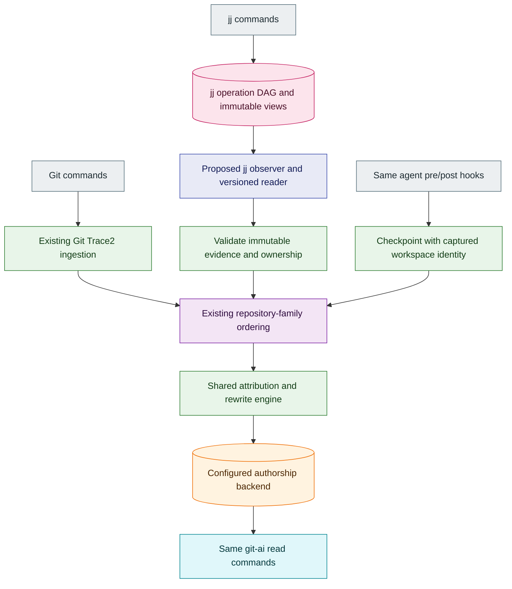
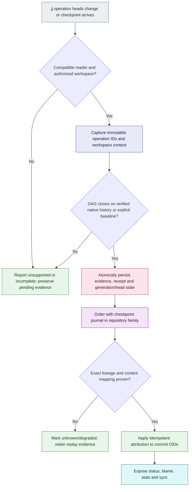

# Native jj support for the personal git-ai fork

Status: proposed native-attribution architecture; context discovery, durable observation storage, native metadata verification, explicit source registration and bounded registered-history collection are implemented on the draft branch. The collector is locally qualified on macOS. Durable native admission is implemented and locally qualified on macOS; experimental read-only observation diagnostics are also implemented and locally qualified. Explicit initialization/capture commands and bounded reconciliation are also implemented and locally qualified; observer integration and attribution remain pending.
Date: 2026-09-07.
Baseline: `woud420/git-ai` at `dc04a6b6aeccc1efa5d544fed21fbdc2130e1872`.
Research baseline: jj v0.45.1. Future jj releases require compatibility qualification.

Reader decision: [ENG-413 proof and replay contract](2026-09-07-jj-reader-proof.md). The prototype validates operation/view domain hashes without Git object access. Resumption requires durable operation membership; raw head sets alone do not cover late concurrency. Recorded import predecessors may be synthetic, so they do not by themselves prove attribution.

Journal contract: [ENG-415 local storage increment](2026-09-07-jj-observation-journal.md). Atomic evidence capture and observed progress are implemented independently of the daemon. Applied attribution remains empty until later replay work.

## Problem and recommendation

jj stores Git-compatible commits, but its local history operations do not run Git
commands. The fork's Git Trace2 pipeline therefore cannot observe jj snapshots,
new changes, or rewrites. Recognizing a hidden Git object store would make files
discoverable while leaving attribution ownership and checkpoint bases incorrect.

Keep the standalone `git-ai` command and agent hook interface common to Git and
jj. Add a separate asynchronous jj operation observer, with versioned immutable
evidence, that eventually feeds the existing repository-family ordering and
authorship engine. Preserve Git's existing Trace2 ownership. Do not wrap either
command, synthesize Git Trace2 frames, add jj probes to the Git ingestion path, or
infer past operations from current HEAD.

The first deliverable is `git-ai debug context --json`: an explicit, read-only
workspace diagnostic that reports discovery capability. It does not enable jj
checkpointing or claim attribution support. Native attribution is gated by a
reader proof and the implementation phases below.

## User experience

| Task | Git workspace | jj workspace after qualification |
| --- | --- | --- |
| Agent integration | Existing pre/post checkpoint hooks | Same hooks and payloads; captured workspace identity differs internally |
| Inspect workspace | `git-ai debug context --json` | Same command; identifies jj and its backing store |
| Inspect attribution | `git-ai status`, `blame`, `stats`, `diff` | Same command names and output conventions |
| Work normally | `git commit`, `rebase`, etc. | `jj new`, `commit`, `describe`, `rebase`, etc. |
| Synchronize credit | Configured notes backend | Same backend, explicit backend-aware sync behavior |

The standalone spelling works independently of Git subcommand dispatch. Existing
`git ai` remains compatible. A `jj ai` spelling is optional future ergonomics;
it must not require a shell wrapper or a custom jj build. Revision arguments need
an explicit source policy: jj revsets are resolved once at a pinned operation
before entering Git-object-based readers. Ambiguous Git/jj expressions must not
silently select a different commit.

V1 targets Git-backed jj repositories, including colocated and noncolocated
workspaces. Additional jj workspaces share a repository family but must have
distinct checkpoint namespaces. Initial native attribution qualification is limited to SHA-1 Git object stores;
SHA-256 requires separate compatibility proof because current fork index reading
rejects it. Diagnostics can report paths without claiming object-format support.
Non-Git backends and unsupported store versions
report unsupported capability. Conflicts and complex rewrites must report
bounded limitations until separately qualified.

## Evidence and rejected shortcuts

| Finding | Consequence |
| --- | --- |
| Upstream issue 412 asks for native support; discussion links a community draft and confirms async migration helps but does not deliver jj support | Treat the draft as input, not an accepted implementation contract |
| jj GitBackend directly accesses Git objects through gitoxide | Git Trace2 does not cover local jj history mutations |
| jj treats the working copy as a mutable commit and can snapshot during ostensibly read-only commands | Do not use ordinary `jj log` or `status` as a passive observer |
| jj operations form a DAG and views record working copies separately from commits | Store complete operation and workspace identities, not a single timestamp or HEAD |
| Full operation IDs avoid mutable head resolution | Pin immutable IDs; never assume `--at-op @` is a completely nonmutating read |
| CLI operation JSON omits view IDs and commit predecessor evidence | A CLI-only JSON poller is not yet a complete rewrite observer |
| Existing Repository construction initializes attribution directories | Context discovery must return a path DTO before constructing Repository or RepoStorage |
| Current checkpoints carry `BaseCommit::Sha/Initial` and repository workdir | jj checkpoint identity needs an explicit migration rather than overloading Git HEAD |
| Production authorship defaults to SQLite; Git Notes and HTTP are optional | Reuse the backend abstraction; do not require or advertise Git Notes alone |

Rejected: wrapping jj, invoking Git once per commit/file/ref, treating reflogs as
complete jj evidence, comparing only the latest change ID, copying credit to all
split outputs, treating `@-` as a universally valid base, and accepting mutable
CLI output as proof of what happened before a checkpoint.

## Architecture

Solid arrows below describe the intended end state. The jj observer, validated
event envelope, and jj checkpoint identity are proposed components; the Git
Trace2, repository-family actor, and authorship backend already exist.

The observer runs outside socket ingestion. Filesystem notifications are wakeups
only; durable immutable operation traversal is authoritative. Missed notifications
are recovered using a persisted cursor. Opt-in workspace registration and bounded
polling/reconciliation discover new work without adding per-frame filesystem reads.

The P0 comparison selected a narrowly scoped direct-store reader for the explicit
`jj-simple-op-store/0.45.1` profile. Pinned CLI evolution reads can miss recorded
predecessors and can rebuild a disposable index. The research reader validates
immutable operation/view domain hashes and bounded ancestry without starting a
transaction, snapshotting a working copy, reconciling heads, or changing metadata.
Its Python proof must still be ported and qualified as a native adapter. No jj-lib
dependency is added by discovery or the first journal increment; future store
profiles require separate qualification.

## Identity and event contract

Separate these identities:

- Repository family: canonical jj repository identity plus Git common object store.
- Workspace: canonical workspace root plus jj workspace identifier; separate from the shared store.
- Operation: full operation ID, its parent operation IDs, and immutable view identity.
- Revision: full Git commit OID and tree identity; jj change ID is supplemental lineage.
- Checkpoint: existing journal identity plus captured workspace, operation frontier,
  working-copy commit/tree, and parent/tree context.

Proposed versioned event fields include source kind, schema/reader version, family
and workspace keys, operation IDs/parents, evidence references, old/new commit and
tree relations, completeness status, and replay/deduplication key. Unknown versions,
truncated evidence, invalid identities, and ambiguous lineage fail closed. Do not
persist arbitrary command descriptions or full user configuration in diagnostics.

A jj change ID survives many rewrites but is neither a commit OID nor a complete
proof of split/squash ownership. Operation timestamp or arrival order cannot replace
the operation DAG. Repository identity canonicalization must handle symlinks and
linked workspaces without collapsing distinct workspaces into the same checkpoint log.

## Ordering, durability, and races

1. Register only authorized workspaces. Capture immutable operation heads; never
   let observer queries repair or merge them.
2. Traverse only operations reachable from captured integrated heads in bounded
   segments. Detached/speculative operations created with `--no-integrate-operation`
   are ineligible unless a separately qualified explicit context adopts them.
   Concurrent branches remain
   explicit until a real jj reconciliation operation joins them.
3. Persist complete validated events before advancing the observed frontier.
   Maintain a separate applied frontier so a crash cannot skip unapplied credit.
4. Order events and checkpoints through the repository-family worker. A late
   checkpoint is joined using captured immutable context, not current checkout.
5. Apply authorship idempotently by immutable commit OID and evidence identity.
   A retry after partial output must converge without duplicating or losing credit.

Use the existing checkpoint journal/outbox and backend write mechanisms where their
contracts match. Prove ordering joins before assuming family-actor FIFO alone
establishes cross-source causality.

Colocated Git and jj can both describe the same resulting object changes. Retain
source ownership and deduplicate semantically with immutable transition evidence.
Do not let a delayed Git event and a jj import both apply the same checkpoint.
A bare content match is not sufficient to transfer ownership.

First-time collection uses an [explicit current-state baseline](2026-09-08-jj-current-state-baseline.md).
The selected head bytes are verified, while their earlier history remains unverified.
[Bounded current-state capture](2026-09-08-jj-native-capture.md) now supplies
source-bound sampled head evidence and the workspace checkout's own verified view.
[Pure ancestry verification](2026-09-08-jj-native-ancestry.md) now closes a bounded
supplied DAG on the reopened baseline or virtual root. The additive
[registration schema](2026-09-08-jj-native-registration-schema.md) now reserves
source and workspace records without backfill.
[Bounded individual record inspection](2026-09-08-jj-native-registration-records.md)
validates canonical bytes and exact keys. [Explicit source registration](2026-09-08-jj-native-registration.md)
now joins the first workspace, published seal and saved cutoff, with all four SQL
rows installed atomically. Filesystem publication and SQL commit remain separate
steps. [Registered history collection](2026-09-08-jj-native-history-collection.md) now reads a bounded DAG from
the sampled heads to the original saved baseline IDs or virtual root; it never
uses opaque observations or earlier extensions as terminals. Local collector qualification is recorded in that decision.
[Durable native admission](2026-09-08-jj-native-admission.md) is now implemented and locally qualified on macOS. It records a separate historical cursor
and still closes only on the original baseline or root; trusted extension cuts,
attachment mutation and recovery remain deferred. Baseline anchors receive no
retrospective attribution and do not enter the pending application queue. Ordinary
checksummed observations are not native ancestry boundaries. A stale workspace outside that range remains unavailable
until its relationship and stable completed-checkout context are proved.

Garbage-collected or missing operations, unsupported stores, size limits, and
unresolvable divergence preserve pending evidence and expose degraded status.
Rebaseline requires an explicit procedure that reports any unknown interval;
it must never manufacture historical credit.

## Checkpoint semantics

Capture the file delta before a concurrent jj command snapshots or changes the
working copy. The observer itself must never trigger a snapshot.
The jj working-copy commit can already contain edits, so Git HEAD or the parent of
`@` alone is not an adequate baseline. Preserve the existing distinction between
AI edits, editor-attested human edits, and untracked edits, with the same agent
pre/post hooks.

The checkpoint implementation must represent workspace-specific snapshots and
parent/merge-tree context explicitly. Immutable file snapshots and the operation
frontier are captured at the producer boundary, then validated asynchronously.
When concurrent jj activity makes this capture inconsistent, retain a retryable or
unknown result; never attribute the entire working copy to the last agent.

The initial supported path is single-parent, conflict-free Git-backed jj:
edit with pre/post hooks, snapshot, `jj new` or `jj commit`, then read line-level
credit. Editing an already populated change must preserve earlier authorship.
Merge commits, unresolved conflicts, and stale workspaces have explicit later gates.

## Attribution and rewrites

| Operation family | Required behavior and qualification |
| --- | --- |
| Snapshot, new, commit | Attach captured deltas to the correct immutable revision, preserving prior credit |
| Describe and simple rebase | Follow exact old/new lineage and tree changes; retain prompts and line ownership |
| Edit, abandon, undo, restore | Preserve historical records; move workspace state only with exact operation evidence |
| Split, squash, absorb | Many-to-many transfer using lineage plus batched content mapping; no blanket copy |
| Automatic descendant rewrites | Account for every affected revision in a bounded batch |
| Concurrent operations/workspaces | Isolate checkpoints and prove DAG reconciliation/replay behavior |
| Conflicts and merge changes | Never interpret conflict markers or unresolved trees as ordinary attributed lines |
| Git import/export in colocated mode | One ownership application despite two observation sources |

Reuse `RewriteEvent`, existing rewrite machinery, batched object reads and notes
backends after establishing each adapter's invariants. Introduce a narrower domain
event where current Git command-shaped events cannot represent jj evidence.
Do not force jj into a misleading Git command category.

## Flow and failure behavior

## Synchronization guarantee

jj v0.45.1 pushes bookmarks/tags and invokes Git push with `--no-verify`; Git
pre-push hooks do not provide a jj barrier, and jj does not natively carry the
authorship notes ref. P9 must distinguish eventual background synchronization
from an explicit common `git-ai` wait/sync barrier with a known operation frontier.
Evaluate extending existing `await` and notes transport before adding a command.
Neither a successful jj push nor a completed Git Trace2 event proves that
authorship has reached a remote backend. Tests must cover an immediate push while
attribution is pending, backend failures, retry and a second clone's read-back.

With `git.sign-on-push`, jj rewrites final commit OIDs inside push, sends objects,
then publishes the operation. A pre-push frontier barrier cannot cover those OIDs.
Qualify signing, partial remote success, and termination after network success but
before operation publication. Missing final lineage must expose pending/unknown
synchronization; do not claim the remote objects already have authorship.

The community draft's separate jj-ai commands, stale-line-range export extension,
and proposed schema revision are not adopted. Preserve authorship/3.0.0 semantics
until a separately reviewed compatibility need is established; unknown credit
must remain unknown rather than exporting stale line numbers.

## Complexity and latency budget

No new work is permitted in Git Trace2 ingestion. Observer output is bounded by
operation count, commit count, bytes, runtime, and queue size. Each bounded batch
uses a fixed number of subprocesses, independent of commits/files/refs; Git object
access uses existing batch plumbing. Avoid both N spawns and N hidden per-object
lookups. A constant spawn count does not excuse unbounded history or memory.

The proof must define measured budgets and checkpoints for overflow/resume. Large
rewrites yield between batches and retain an exact durable frontier. Benchmark
Git ingestion before/after and jj observer throughput, catch-up latency, checkpoint
latency, memory, and process count. Numeric release thresholds are set from the
baseline measurement, not invented in the proposal.

## Delivery sequence

| Phase | Independently reviewable outcome | Dependencies |
| --- | --- | --- |
| P0 | Prove a read-only, versioned jj operation/lineage reader | None |
| P1 | Read-only Git/jj context discovery and real jj test fixtures | None |
| P2 | Bounded immutable operation adapter and durable replay cursor | P0, P1 |
| P3 | Cross-source family ordering, deduplication, and recovery | P2 |
| P4 | jj-aware checkpoint identity and immutable snapshot capture | P3 |
| P5 | Basic jj snapshot/new/commit attribution end to end | P4 |
| P6 | Exact one-to-one rewrites, navigation, undo/restore | P5 |
| P7 | Split/squash/absorb and descendant rewrite attribution | P6 |
| P8 | Shared status/blame/stats/diff and revision semantics | P5 |
| P9 | Backend-aware sync and colocated Git/jj interoperability | P6, P8 |
| P10 | Cross-platform qualification, performance gates, packaging and docs | P7, P8, P9 |

P0's reader proof and P1's diagnostic are committed. P2 has a durable observation
journal, bounded lookup, native operation/view hashing, captured-envelope joins
and completed-checkout decoding, plus explicit baseline persistence and verified
reopening. Bounded current-state capture and pure ancestry verification are also
implemented. Schema v3 adds empty source/workspace registration tables while
preserving existing baseline receipts. Bounded individual registration-record
reads are implemented. [Explicit source registration](2026-09-08-jj-native-registration.md)
now publishes a seal and atomically installs the first workspace and saved native
cutoff in SQL; reopen and retry retain that cutoff after heads or checkout advance.
[Registered history collection](2026-09-08-jj-native-history-collection.md) now composes that fresh registration
join with bounded parent traversal and final retained rechecks; its local qualification
is recorded in that decision. It returns evidence without advancing any journal progress.
[Durable native admission](2026-09-08-jj-native-admission.md) now composes retained
collection, transactional native revalidation and a separate generation cursor;
local qualification is recorded in that decision. P2/ENG-415 stays in progress. Attachment
mutation, explicit recovery and observer integration remain pending.
The [observation diagnostics decision](2026-09-08-jj-observation-diagnostics.md)
records the implemented experimental status/receipt commands and exact-schema read-only opener.
The [explicit capture decision](2026-09-08-jj-explicit-capture.md) records the
implemented initialization/capture commands, original-cutoff retries and their qualified side effects.
The [reconciliation decision](2026-09-08-jj-native-reconciliation.md) records the
bounded backend attempt: remembered workspace and cursor checks, unchanged
samples without admission writes, and changed samples through existing admission.
Original-cutoff overflow still prevents complete observer catch-up; reconciliation
adds no scheduler or automatic activation. Later phases remain tracked until
their acceptance tests pass. These increments are
published on [draft PR #247](https://github.com/woud420/git-ai/pull/247) and do not
enable native attribution. Work continues in scoped commits with human review
before merge.

## Validation and rollout

Tests must use real repositories and real jj, with the existing TestRepo harness
for Git/daemon isolation. Deterministic malformed-layout tests complement actual
colocated, noncolocated, linked-workspace and subdirectory cases. Pin the jj release
used for qualification and fail clearly if a requested jj test lane lacks it;
do not silently report skipped integration tests as support.

Start every production slice with failing behavioral tests. For attribution
slices assert content and line-level credit after every relevant revision.
Include both SQLite production behavior and Git Notes test behavior, with HTTP
backend coverage where relevant. Cover replay, restart, missed wakeups, divergent
heads, operation GC, large rewrites, denied repositories, unknown schema, missing
jj, symlinks, spaces, Windows paths and nested repositories.

P1 validates that discovery creates no ai storage, does not invoke jj or Git,
does not snapshot dirty files, and returns identical context from subdirectories.
Malformed/unknown jj layouts stop at their own boundary instead of falling through
to an enclosing Git repository. The initial JSON explicitly says discovery-only.

Native jj attribution ships behind a capability/feature gate until P10 is green.
Installer changes must be reversible and preserve existing agent integrations.
Migration must preserve existing Git working logs and notes; rollout documentation
must state unsupported operations and downgrade/recovery procedures.

## Existing code to reuse

- `src/operations/git/repo_state.rs`: filesystem Git path/identity helpers.
- `src/operations/git/repository/discovery_no_exec.rs`: evidence of Repository
  construction boundary; do not call its storage-initializing constructor for diagnostics.
- `src/model/checkpoint_request.rs` and
  `src/operations/commands/checkpoint_agent/orchestrator.rs`: checkpoint identity
  and producer flow (inspect nested modules when implementing).
- `src/operations/daemon/family_actor.rs` and checkpoint journal/outbox modules:
  ordering and durable delivery.
- `src/model/domain.rs` and `src/operations/authorship/rewrite/mod.rs`:
  shared rewrite domain and attribution.
- `src/operations/git/cat_file.rs`: batched Git object reads.
- `tests/integration/repos/test_repo/`: isolated real-repository test harness.

## Research sources

- [Upstream native jj request](https://github.com/git-ai-project/git-ai/issues/412).
- [Community draft linked from the request](https://gist.github.com/dmmulroy/fb3205b49cfe917cdc50e39124d652b9).
- [jj working-copy model](https://docs.jj-vcs.dev/latest/working-copy/).
- [jj operation log](https://docs.jj-vcs.dev/latest/operation-log/).
- [jj Git compatibility](https://docs.jj-vcs.dev/latest/git-compatibility/).
- [jj v0.45.1 release](https://github.com/jj-vcs/jj/releases/tag/v0.45.1).
- [Pinned Git backend source](https://github.com/jj-vcs/jj/blob/v0.45.1/lib/src/git_backend.rs).
- [Pinned operation serialization](https://github.com/jj-vcs/jj/blob/v0.45.1/lib/src/op_store.rs).
- [Pinned operation-head resolution](https://github.com/jj-vcs/jj/blob/v0.45.1/lib/src/op_heads_store.rs).
- [Pinned operation walking](https://github.com/jj-vcs/jj/blob/v0.45.1/lib/src/op_walk.rs).
- [Pinned batched evolution command](https://github.com/jj-vcs/jj/blob/v0.45.1/cli/src/commands/evolog.rs).
- [Pinned jj push subprocess](https://github.com/jj-vcs/jj/blob/v0.45.1/lib/src/git_subprocess.rs).
- [Pinned operation-log command](https://github.com/jj-vcs/jj/blob/v0.45.1/cli/src/commands/operation/log.rs).

Live research and runtime evidence are summarized in the companion
`2026-09-07-jj-support-evidence.md`. Linear phase links and implementation status
are recorded there so this document keeps the proposed architecture distinct from
the delivered slice.

## Linear delivery map

Parent: [ENG-412](https://linear.app/polarcoordinates/issue/ENG-412/deliver-native-jj-attribution-with-the-shared-git-ai-workflow), in the existing [Q3 personal git-ai fork project](https://linear.app/polarcoordinates/project/2026q3-personal-git-ai-fork-5f510f0283ea).

| Phase | Issue | Outcome |
| --- | --- | --- |
| P0 | [ENG-413](https://linear.app/polarcoordinates/issue/ENG-413/prove-a-bounded-read-only-jj-operation-and-lineage-reader) | Prove a bounded read-only jj operation and lineage reader |
| P1 | [ENG-414](https://linear.app/polarcoordinates/issue/ENG-414/add-read-only-git-and-jj-workspace-context-diagnostics) | Add read-only Git and jj workspace context diagnostics |
| P2 | [ENG-415](https://linear.app/polarcoordinates/issue/ENG-415/ingest-immutable-jj-operation-evidence-with-durable-replay) | Ingest immutable jj operation evidence with durable replay |
| P3 | [ENG-416](https://linear.app/polarcoordinates/issue/ENG-416/order-jj-evidence-and-git-events-with-checkpoint-replay) | Order jj evidence and Git events with checkpoint replay |
| P4 | [ENG-417](https://linear.app/polarcoordinates/issue/ENG-417/capture-jj-checkpoints-against-immutable-workspace-context) | Capture jj checkpoints against immutable workspace context |
| P5 | [ENG-418](https://linear.app/polarcoordinates/issue/ENG-418/preserve-attribution-through-basic-jj-snapshot-and-commit-workflows) | Preserve attribution through basic jj snapshot and commit workflows |
| P6 | [ENG-419](https://linear.app/polarcoordinates/issue/ENG-419/preserve-jj-attribution-across-rebase-and-operation-recovery) | Preserve jj attribution across rebase and operation recovery |
| P7 | [ENG-420](https://linear.app/polarcoordinates/issue/ENG-420/map-jj-split-squash-and-absorb-attribution-without-duplicating-credit) | Map jj split squash and absorb attribution without duplicating credit |
| P8 | [ENG-421](https://linear.app/polarcoordinates/issue/ENG-421/unify-git-ai-read-commands-and-revision-semantics-for-jj) | Unify git-ai read commands and revision semantics for jj |
| P9 | [ENG-422](https://linear.app/polarcoordinates/issue/ENG-422/synchronize-jj-authorship-through-the-existing-backend-and-transport) | Synchronize jj authorship through the existing backend and transport |
| P10 | [ENG-423](https://linear.app/polarcoordinates/issue/ENG-423/qualify-and-document-native-jj-support-before-enabling-rollout) | Qualify and document native jj support before enabling rollout |

Issue descriptions, canonical labels, parent links, assignee, state and blocking dependencies were read back after creation. The explicit dependencies are the delivery gate; preliminary source/runtime research does not close P0.
