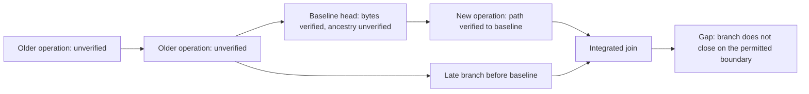

# Current-state baseline for native jj admission (ENG-415)

Status: proposed — pure preparation and explicit persistence are implemented; native extension admission remains pending.

Start collection from a bounded capture of the current raw operation-head set.
Prior history remains unverified. Historical verification is a later explicit mode.
This is the default proposed for first-time setup, not an automatic recovery
procedure for missing history after collection has started.

## Meaning of the baseline

A baseline is an explicit limit on the history we examined. Its head operation
and view bytes must pass `verify_evidence`, but those heads are **not certified
ancestry** and are not processed as newly completed operations. Their original
parent IDs remain intact even when none of those parents has been loaded.

The first subsequent operation can have a fully checked path to this baseline
without having a checked path to the virtual root. These are different claims.
Existing authorship notes are preserved; baseline content receives no new AI or
human attribution merely because collection started.



The arrow direction above is history progression; persisted parent edges point
in the opposite direction. The missing path through B must never be replaced by
a fabricated root edge or inferred from timestamps, checkout contents, or Git
commit ancestry.

## Facts that must remain separate

| Fact | What it establishes | What it does not establish |
| --- | --- | --- |
| Opaque journal record | Durable captured bytes and envelope integrity | Native content addresses or ancestry |
| `VerifiedJjEvidence` | Native operation/view hashes and exact envelope joins | Current source binding, integration, ancestry or admission |
| Current-state baseline anchor | Exact operation ID chosen as the start boundary, with verified bytes | The anchor's parents or preceding history |
| Native extension decision | Supplied new DAG closes on root, permitted baseline anchors, or earlier verified extensions in this epoch | Historical verification beyond an encountered baseline |
| Application receipt | A specific attribution effect completed idempotently | That every captured or baseline operation was applied |

No generic `verified: bool` or `certified_heads` field should collapse these facts.

## Reviewable durable model

Use a separate native-baseline record, not a special ordinary pending operation:

```
CurrentStateBaseline {
    record_version,
    reader_profile,
    source_id,
    baseline_id,
    mode: CurrentState,
    captured_head_ids,       // exact raw set, sorted only for canonical storage
    anchors,                 // exact original JjOperationEvidence, one per head
}
```

The durable native progress for an epoch separately references `baseline_id`,
has its own generation and head set, and records decisions as `BaselineAnchor`
or `ExtensionToBaseline`. Baseline anchors do not enter the application queue.
No baseline installation advances `applied_heads` or claims historical work is
complete. Ordinary extensions retain which baseline they depend on.

The baseline record should use the existing bounded encoding/checksum policy,
source-scoped identity/collision rules, and FULL-synchronous transaction policy.
Its receipt includes the mode, source, profile, expected native generation, exact
heads, and original evidence bytes. Historical receipt retry precedes generation
CAS and never rewinds state. A changed request cannot replace an existing first
baseline. A later reset requires a new explicit epoch and a visible gap.

On reopen, checksum/schema validation and native evidence verification precede
using an anchor. No stored boolean substitutes for these checks. A missing or
corrupt anchor makes dependent admission unavailable; never fall back to an
opaque observation with the same ID or silently create another baseline.

## Admission invariants

1. A source baseline is installed once against empty native progress. Existing
   opaque observations may remain, but they are not automatically native facts.
2. The head set is nonempty, unique, bounded, and exactly represented by anchor
   evidence. Do not reduce redundant raw heads using unexamined ancestry.
3. Every anchor passes the existing envelope limit and pure native verifier.
   Its ordered parents and bytes are not rewritten. Missing older ancestors and
   unrecorded predecessor maps are permitted for anchors because no old event is
   applied. A later extension can impose its own predecessor-presence gate.
4. First-use capture must establish stable source identity and recheck raw heads
   before durable installation. Pure preparation alone cannot establish that
   supplied IDs were current heads. Neither timestamps nor canonical paths alone
   are physical-source identity proofs.
5. Traversal may stop on an exact same-source, same-epoch baseline anchor. The
   result is closure **to that baseline**, never closure through it.
6. A previous native extension can be a stop point only with its persisted
   epoch/baseline dependency intact. A merely observed or individually verified
   operation is insufficient. This preserves late-branch detection beyond the
   most recent head set.
7. Every new node must be reachable from captured heads, acyclic, native-verified,
   and parent-complete to a permitted boundary. Unknown parents outside that
   boundary produce a gap. Budget exhaustion leaves native progress unchanged.
8. A branch reaching an older unverified B below anchor H does not close merely
   because B is mentioned in H's parent list. No automatic boundary widening.
   Existing-history verification or a later explicit new baseline can recover;
   either preserves the visible distinction from continuous collection.

## Stale and linked workspaces

The source baseline is the integrated operation-head set, not whichever operation
a particular workspace last checked out. Persist checkout bytes/context separately
from anchors, and do not treat the checkout operation as an extra ancestry cut.

A workspace is initially usable only after stable checkout capture and a proven
relation to the active native range. The simple first case is checkout operation
equal to an active baseline head, with its workspace name present in that verified
view. Later, a checked path through admitted extensions must establish the joined
relation. Membership in an old view, a matching commit ID, or source-path equality
does not prove that relation.

If checkout points outside the verified future range, report workspace context as
unavailable/stale and retain pending checkpoint evidence. Do not invoke `jj` to
update it, guess from a different workspace, add the stale operation as an anchor,
or assert that the filesystem matches a newer view. An integrated-head change or
checkout update requires the relation and mutable checkout recheck again.

## Implemented pure preparation

The first slice is pure preparation, independently of the journal schema:

```
prepare_current_state_baseline(profile, captured_head_ids, anchor_evidence)
    -> PreparedCurrentStateBaseline<'a>
```

The result has private fields and immutable borrowed accessors. It reuses
`verify_evidence`, requires exact one-to-one head/evidence membership, preserves
raw parent order/bytes, and exposes `CurrentState` as the boundary reason. It is
not an admission certificate and cannot claim the IDs are currently integrated.
It enforces a 32-head cap, an 8 MiB aggregate raw-byte cap, and each envelope's
combined 1 MiB cap. It makes no encoded-size or serialization claim. Reject aggregate excess before validating
or retaining an unbounded collection of decoded records.

The tests cover:

- Real TestRepo jj history with current H and unprovided parent B: preparation
  accepts H as an explicit boundary while preserving B and leaving journal state,
  pending operations, applied heads, and older evidence unchanged.
- Opaque H with false envelope parents, wrong view, or wrong native hash rejects.
- Empty/duplicate heads; absent head evidence; detached extra evidence; duplicate
  evidence; unsupported profile; per-envelope and aggregate limits reject.
- Raw head reordering is set-equivalent, while ordered operation parents remain
  exact. Semantically equivalent raw protobuf bytes are still borrowed unchanged.
- A current anchor with unrecorded predecessors remains a baseline, not an event
  queued for retrospective application.
- The prepared object exposes no workspace readiness or admission claim. Stale
  checkout C needs no special acceptance path because preparation cannot bind a
  workspace at all.

All 17 baseline tests passed: 16 default cases and one explicit real-jj 0.45.1
TestRepo lane. RED was recorded before production on the missing API; a test-only
reference annotation removed a compiler inference cascade so the final RED
contained missing APIs only. Independent review found no actionable issues.
A fresh build, Rust 1.93 all-target lint, formatting and 238 focused tests passed:
17 baseline, 27 operation, 36 view, 13 envelope, 13 checkout, 15 context, 72 journal,
12 source/storage policy and 33 fork workflow policy cases. The journal child
helper remains ignored in ordinary collection and is exercised by its recovery
test. The updated flowchart was rendered and visually inspected.

Explicit [baseline persistence and reopening](2026-09-08-jj-native-baseline-persistence.md)
now provide generation checks, two-writer winner, receipt replay, corruption and
rollback coverage. [Bounded native capture](2026-09-08-jj-native-capture.md) now
revalidates source locators, samples heads/checkout and joins the checkout
workspace to its own verified view. The captured source identity is sampled;
durable registration and workspace readiness remain separate. Next add native
extension admission and tests for N→H, late D→B, mixed-parent joins, opaque-known-
parent rejection, source/epoch mismatch, and bounded gaps.
The separate workspace-join slice must include a real stale linked workspace C
outside H, prove it remains unavailable, and only make it ready after an admitted
relation and stable checkout recheck establish the binding.

## Existing-code constraints

- `jj_observation_journal/graph.rs::visit` currently closes unseen parents only
  on the virtual root or stored opaque operations. Do not weaken this ordinary
  capture contract to install a baseline.
- `jj_operations` rows all have positive pending sequence numbers;
  `pending_operations` and sequence-gap checks assume they are pending capture
  records. Baseline anchors need a separate representation.
- `StoredState::validate` and `lookup_observed` require observed heads to have
  matching stored evidence. Setting those heads without rows would create a gap.
- The [atomic schema-v2 migration](2026-09-08-jj-native-baseline-schema.md)
  adds separate native tables while preserving all opaque version-1 records.
  It does not backfill native evidence or weaken ordinary capture closure.

The native [evidence verifier](2026-09-07-jj-native-evidence-verifier.md) and
[checkout decoder](2026-09-07-jj-native-checkout-decoder.md) supply the existing
per-record checks. Explicit persistence is available; extension admission and
workspace readiness remain subsequent, separately testable gates.
