# Explicit initialization and capture of native jj observations

Status: accepted — implemented and locally qualified on macOS for the pinned jj profile.

Refs: [ENG-415](https://linear.app/polarcoordinates/issue/ENG-415),
[native registration](2026-09-08-jj-native-registration.md),
[native admission](2026-09-08-jj-native-admission.md),
[read-only diagnostics](2026-09-08-jj-observation-diagnostics.md).

## Decision

Add two explicit consumers to the experimental standalone debug CLI:

```text
git-ai debug jj initialize --journal PATH --json
git-ai debug jj capture --journal PATH --json \
  --expect-source SOURCE_ID --expect-initialization-receipt RECEIPT_ID \
  --expect-baseline BASELINE_ID --expect-generation N \
  --expect-head OPERATION_ID [--expect-head OPERATION_ID ...]
```

`initialize` calls `register_current_state` once. First use installs the sampled
head cutoff, source registration and initial workspace attachment; retry retains
the original receipt, attachment and cutoff even when current heads advance.
Saved head anchors do not certify their older ancestry. No additional workspace
attachment, relocation, recovery or implicit rebaseline is provided.

`capture` calls `admit_registered_history` once with the exact supplied expectation.
It admits a bounded, verified historical DAG against the original cutoff/root;
previous admissions and opaque journal membership cannot widen that boundary.
It never initializes an unregistered source or refreshes a stale expectation.
Native attribution and automatic observation remain disabled. Existing Git
Trace2 ingestion, hooks and ordinary status/blame/stats behavior are unchanged.

The [rendered flow](../architecture/diagrams/jj-explicit-capture-flow.svg) shows
the journal-opening boundary, retained checks, commit and possible refusal residue.
Its [Mermaid source](../architecture/diagrams/jj-explicit-capture-flow.mmd) is editable.



## Syntax and request identity

Require an explicit journal and `--json`. Flags are order-free; scalar flags occur
once. Only `--expect-head` repeats: 1–32 distinct, nonroot, 128-lowercase-hex IDs,
using the existing baseline head limit and validators. Scope IDs are 64 lowercase
hex characters, including syntactically valid zero IDs. Generation is canonical
unsigned decimal, `0 <= N < i64::MAX`, without signs, whitespace or leading zeros.
Bound argument count to 80 before collecting heads and reject a 33rd head before
retaining it. The largest valid request uses 76 tokens including its action.

Reject unknown/duplicate flags, missing values, positional arguments, mixed help
and `--flag=value`. Exact group/action help remains platform-independent. Valid
write requests on unsupported platforms reject before Config or path access.
Reader profile and baseline generation remain saved coordinator facts, not flags.

## Opening and side effects

On Linux/macOS, parse first, then load Config, reject empty opt-in and discover a
jj workspace. These early failures precede journal opening. A CLI-only ordinary
path guard rejects empty paths, exact `:memory:` and leading `file:` before the
writable opener. Relative paths and spaces work; `./file:...` addresses a literal
name. Preserve the existing writable journal API and ordinary symlink semantics;
this CLI does not acquire a descriptor-bound journal lease or precheck existence.

Check the shared deadline before and after `open_at_path`. Opening may create
parents/database, configure WAL/durability and migrate supported old schemas.
**Full canonical repository policy runs inside the coordinator after opening.**
Nonempty-but-denied policy, missing registration, stale scope/CAS or native refusal
may therefore leave an initialized/migrated journal and SQLite sidecar changes.
Opening an invalid existing database may also affect headers/sidecars before refusal.
Help must state these effects rather than promise journal noncreation on refusal.

First initialization authorizes retained C0 before seal publication, then captures
and authorizes C1 before staging four registration/baseline rows. A later failure
can leave an unavailable namespace, temporary file or final seal without SQL
registration. Never adopt or clean up that residue automatically. Capture publishes
no seal. SQL rollback does not undo journal opening or seal publication; filesystem
and SQLite changes are not atomic together. The coordinator owns the sole commit
of its native update, after saved-data and final retained-source checks.

## Results, errors and retry

Reuse the JSON envelope: schema_version 1, backend jj, attribution_enabled false,
current_source scope, and action initialize/capture. Initialize returns installed
or already_registered plus saved source/receipt/attachment/profile/baseline IDs,
baseline generation, captured heads and fresh workspace name/checkout relation.
Do not fabricate an admission generation-zero cursor on an existing source.

Capture returns admitted or already_admitted, the verified current cursor, and a
nonnull admission containing the original receipt, operation count and closure
metadata. Exact retry can return an older receipt beside a newer current cursor.
Build output from the coordinator's owned result; no fallible post-success status
fetch is allowed. Output failure may lose a committed reply without undoing it.

Success metadata excludes raw evidence, descriptions, host/user fields, paths and
source-binding internals. Sanitize writable-opener SQLite and filesystem I/O errors
to static operation plus typed code/kind, excluding free-form message and path.
Coordinator errors retain bounded semantic Display; this is not blanket redaction
of every nested cause. Reuse error codes, adding registration_unavailable for
initialize; capture uses admission_unavailable. Errors retain exit1.

An exact capture retry requires the same expectation and unchanged collected DAG;
matching a generation alone is insufficient. A changed DAG with stale expectation
refuses. Inspect status/known receipts, then explicitly provide a new expectation;
never guess a lost receipt, refresh the cursor silently or loop automatically.

## Budgets and qualification

Each write action shares one 48-MiB selected-SQL-BLOB budget and one cooperative
five-second deadline, without resets. The current conservative bounds are
41.75 MiB for fresh admission and 33.125 MiB for a distinct exact retry. Native
capture/publication caps stay unchanged. These limits do not bound SQLite pages,
peak heap, discovery/configuration I/O, blocking calls or commit wall-clock time.

Tests preceded production using the existing TestRepo/NoDaemon Config child and
actual-process dispatch. After correcting a fixture query and missing import,
ten cases failed at the missing actions/help while the invalid-input control
passed; the real-jj lane remained ignored. Those scaffolding corrections are
separate from behavioral RED.

The first implementation passed ten ordinary cases and exposed a repeatable
SQLite corruption error after a subprocess capture in the remaining case. The
fixture snapshot read live database/WAL/SHM files before discarding their bytes.
Such raw descriptor closes can release process-level SQLite locks, as described
in SQLite's [locking guidance](https://www.sqlite.org/howtocorrupt.html#_posix_advisory_locks_canceled_by_a_separate_thread_doing_close).
A separate two-process probe demonstrated a writer acquiring a lock after those
raw reads while the original connection still held an active transaction.

Three test helpers now omit the same exact filenames before opening them; SQL,
schema, native/config and unrelated-file assertions remain intact. Descendants
of unexpected excluded-name directories remain covered. The unchanged failing
case and all 11 ordinary cases passed with production bytes unchanged. A later
policy check required the new test's read-only SQLite connection to use the
existing memory-limited helper; the flag and assertions stayed unchanged, and
all 11 affected cases passed again.

Local qualification passed 188 jj unit tests, 420 default jj integration tests
(with 24 explicit/child lanes ignored), and two separately invoked pinned real-jj
CLI lanes. These cover read-only diagnostics plus initialization, an actual
successor capture, exact retry and receipt inspection with dirty bytes preserved.
The debug-context filter passed 12 cases with three ignored. Final checks passed
22 policy cases, six internal-spawn checks, 33 fork workflow policies, fresh build,
format check and Rust 1.93 all-target Clippy. The broad suite preceded the final
test-only connection-helper correction; its affected 11-case suite and policy
checks were rerun afterward. Independent reviews covered implementation,
fixtures, preserved snapshot coverage and the rendered flow.

These macOS results do not establish Linux or Windows runtime qualification.
The six earlier native admission/history/registration real-jj lanes were not
rerun in this increment. Automatic observation, additional workspace attachment,
recovery and native attribution remain follow-ups.
