# Durable admission of bounded jj history

Status: accepted — implemented and locally qualified on macOS for the pinned jj profile.

Refs: [ENG-415](https://linear.app/polarcoordinates/issue/ENG-415),
[schema 4](2026-09-08-jj-native-admission-schema.md),
[registered collection](2026-09-08-jj-native-history-collection.md),
[source registration](2026-09-08-jj-native-registration.md).

## Decision

Add three maintained APIs in `operations::jj::admission`, initially supported
on Linux and macOS. Other platforms reject before path or policy access.
The journal is caller-owned; every API receives an absolute deadline and the
same caller-owned cumulative SQL `ReadBudget` throughout its attempt.

| API | Inputs beyond journal/deadline/budget | Result and boundary |
| --- | --- | --- |
| `read_registered_admission_state` | Workspace context and configuration | Fresh registered-source checks, verified saved cursor and latest receipt; no current ancestor walk |
| `admit_registered_history` | Workspace context, configuration and expected source/initialization receipt/baseline/generation/head set | `Admitted` or `AlreadyAdmitted`, with the requested historical receipt and separate current cursor |
| `read_native_admission` | Exact source and admission IDs | Verified historical packet or checked absence; SQL/native validation only, without current filesystem or policy authority |

Public expectations are untrusted optimistic constraints. Owned collector
results, historical receipts and plain IDs cannot authorize a write. Admission
opens a fresh retained session internally and preserves it through the sole
SQL commit. Public results have private fields and immutable accessors.

Each packet contains a complete historical DAG to the exact original baseline
heads or virtual root. Baseline generation stays 1. Earlier admissions, opaque
observations and parents below a baseline anchor never become traversal cuts.
Root-only and mixed closure are valid without proving operation newness or
ancestry from the previous admission heads. Reaching a stale checkout through
a parent edge does not upgrade its saved relation or attribution readiness.

## Storage and identity

The existing schema-4 `jj_native_admissions` table holds immutable source/ID
packets and a unique source/generation pair. `jj_native_admission_states` points
to the latest packet with a composite foreign key. This feature uses those two
tables without changing registration, workspace, native baseline or opaque bytes.
There is no genesis row, migration backfill or automatic attachment creation.

Packet identity and checksum are SHA-256 of the entire canonical version-1 CBOR
packet under `git-ai/jj/native-admission/packet/v1`. The digest includes source,
pinned reader profile, initialization receipt, baseline identity/generation,
expected admission generation/head set, captured head set and ordered evidence.
Head sets are sorted canonically; native parent order and deterministic
parent-first operation order are preserved. Raw operation/view fields use CBOR
byte strings; older opaque and baseline serialization formats remain unchanged.

The independently checksummed state uses `git-ai/jj/native-admission/state/v1`.
Its positive generation is exactly packet expected generation plus one, within
SQLite's signed integer range, and its heads equal that packet's captured heads.
Structural decoding and SHA-256 checks never substitute for native operation/view
content hashes and complete ancestry verification against the saved baseline.

## One admission transaction

The [flow source](../architecture/diagrams/jj-native-admission.mmd) describes
the write path; its rendered output was inspected for readable labels and validation order.

1. Validate expectation shape and explicit collection opt-in. Open one retained
   history session, apply full existing repository policy and canonical descriptor
   matching, then load and natively verify the complete saved registration.
2. Collect from the successful two-pass head sample to the original cutoff/root
   outside the write transaction. Borrow the bounded completed evidence without
   cloning raw bytes or consuming the retained session. Prepare the canonical ID.
3. Begin IMMEDIATE. Read complete registration, original/selected workspace,
   baseline, current state/latest packet and distinct requested packet. Recheck
   saved bindings and native baseline/latest/requested evidence before mutation.
4. Check integrity before retry or CAS: selected source/generation must identify
   exactly one packet; an indexed higher-generation probe rejects a pointer behind
   a surviving newer packet. An exact historical request returns its original
   receipt before CAS and preserves current progress. Otherwise require exact
   generation/head-set CAS, then insert the packet and insert/update the state.
5. Require one affected row per mutation. Drop encoded buffers before complete
   in-transaction readback. Require the intended request/state and unchanged saved
   joins, then reverify native baseline/latest/distinct requested evidence.
   An exact retry reuses its verified snapshot without a second SQL readback.
6. Move the fully checked owned public result out of the staged snapshot before
   releasing capture borrows. Perform the retained metadata/seal/edge recheck and
   deadline check, then consume the commit-only handle. No fallible validation or
   result conversion follows successful commit. Earlier errors roll back the SQL
   transaction and return no admission result; no filesystem repair is attempted.

The saved roots remain historical even if raw heads/checkout advance after their
sample. Final checks add no third head scan or checkout demand. Sampled source
continuity is not an atomic filesystem/SQL snapshot or an ABA defense.

## Retry, absence and readers

Complete valid registration plus absence of both admission row families derives
generation 0 with original baseline heads. An explicit baseline-only empty packet
can advance 0 to 1. A fresh cursor may deliberately record repeated heads; no
automatic no-change coalescing is introduced. Generation participates in the
request identity, keeping fresh A→B→A observations distinct.

An identical entire request can retry after later progress without rewinding it.
If a reply is lost and sampled heads later change, an old cursor does not identify
that earlier request. Read verified current status or a known exact ID, then make
a fresh request; never infer that a packet at expected generation plus one belongs
to the caller. A stale new request fails even when its head set happens to match.

Source-bound status uses fresh policy/capture/final checks and revalidates saved
native evidence. The known-ID reader instead uses the original saved workspace
and complete historical registration/baseline/current-state joins. It verifies
the latest packet and a distinct requested packet; aliases reuse one object and
one BLOB charge. Checked absence is returned only after current integrity passes.
Unselected older packets are not enumerated or certified by either reader.

One-sided gaps, duplicate selected generations and surviving later packets behind
a lower pointer are errors. **Coherent erasure of both admission row families
remains indistinguishable from first use.** Coherent rollback to a valid older
nonzero state instead appears to be valid older history. A retained newer cursor
conflicts against derived zero or that older state; discarding it loses this
evidence of regression.
No activation witness, silent reset, rebaseline or recovery is claimed.

## Resource bounds

The retained collector keeps its existing 256-pair/8-MiB raw union, including
sampled baseline heads, 1-MiB per-pair cap and separate 1-MiB checkout diagnostic.
It retains the 32-head/parent bounds and aggregate 4,096 predecessor-reference and
4,096 view-reference caps. Native filesystem permits stay 10 MiB/640 file attempts,
254 directory slots including streams and at most 256 scoped native descriptors;
component/open/edge and head-scan caps remain unchanged. No budget resets occur.

Encoded packet admission separately caps 8 MiB; raw 8 MiB need not fit encoding.
State, registration, workspace and native-state records each cap 128 KiB; the
native baseline caps 8 MiB. Let P=8 MiB, S=128 KiB, R0=8 MiB+3S for an original
workspace registration snapshot, and R=R0+S when the selected workspace differs.

| Path | Conservative selected encoded-BLOB charge ceiling |
| --- | --- |
| Fresh status with latest | R+S+P |
| Known distinct ID, original workspace | R0+S+2P |
| New admission with prior latest | R+(R+S+P)+(R+S+P) |
| Exact retry of latest | R+(R+S+P) |
| Exact retry distinct from latest | R+(R+S+2P) |

These are format-based bounds, not default budgets, query counts, SQLite-page I/O,
heap limits or a promise all maxima fit together. Selected bytes remain charged
after validation fails; absent payloads add none. Fixed indexed LIMIT 1/2 probes
avoid packet enumeration and per-native-node SQL work. No total query ceiling is
claimed before measurement of the final call graph.

Native capture, seal reads and storage spawn no Git/jj processes or Git object
lookups. Policy is a separate existing stage: its cold Git installation lookup
and complete configuration includes retain their established semantics. Native
budgets do not bound policy I/O or time. Deadline checks are cooperative and
cannot cancel a blocked syscall or guarantee a wall-clock limit on SQL commit.

## Qualification and remaining boundary

Public, private coordinator and model tests were installed before their APIs.
Their initial RED results identify missing APIs, not behavioral regressions; the
model scaffold needed three existing-type imports before that clean RED. The
first complete candidate passed all 47 model/visitor cases, 12 coordinator/helper
cases and 20 public API cases. Nine borrowed-capture tests passed separately.
Independent reviews covered source binding, wire limits, SQL budgets, retry/CAS,
readback and commit ownership. Later source edits only added platform gates and
removed unused reexports; a documentation lifecycle label was also corrected.

Final local macOS qualification passed 187 jj unit tests and 387 default jj
integration tests, with 22 explicit/child lanes ignored by the default command.
Six separately invoked pinned-jj cases covered admission, history collection and
registration in both colocated and separate-store repositories. The run also
passed 19 policy-filter cases, six internal-spawn checks, 33 fork workflow policies,
a fresh build, format check and Rust 1.93 all-target Clippy. These results do not
infer Linux or Windows runtime success; CI and feedback remain tracked on the draft PR.

The frozen fixture oracle independently qualified canonical packet/state bytes,
native content hashes, exact/one-over encoded limits and SQL fault setups. The
rendered 12-node flow was visually inspected. Native admission APIs and their
registration-dependent storage module reject or are gated on unsupported platforms;
existing native readers and generic sequence-limit tests retain their portability.

Admission advances only its separate historical cursor. It creates no applied
progress, attribution certificate, checkpoint ordering, authorship notes, observer,
CLI command or Trace2 ingestion work. Complete paths to the original cutoff may
eventually exceed bounds; this version neither widens that cutoff nor silently
resumes partial history. Power-loss simulation and tamper-proof storage are not
claimed by transaction rollback tests.

The later [observation diagnostics increment](2026-09-08-jj-observation-diagnostics.md)
adds experimental read-only status and historical receipt commands.
[Explicit initialization/capture commands](2026-09-08-jj-explicit-capture.md) are
also implemented; automatic observation remains a follow-up.
