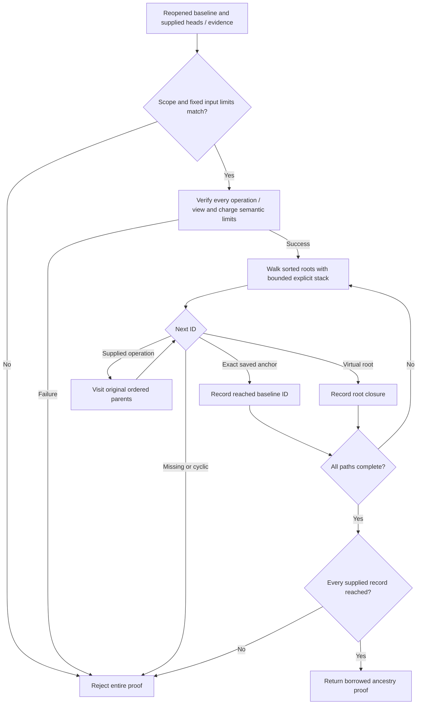

# Native operation ancestry to a saved jj baseline (ENG-415)

Status: accepted — pure ancestry verification; source registration and durable admission remain separate.

## Contract

`operations::jj::ancestry::verify_ancestry_to_baseline` verifies a supplied native
operation DAG against a reopened `DurableCurrentStateBaseline`. It checks the
caller-declared source namespace, reader profile, baseline identity and expected
native generation against that immutable receipt. The current baseline represents
native generation 1; opaque observation generations have no authority here.

The returned `VerifiedJjAncestry` borrows the original evidence, requested heads
and saved baseline. Private fields and immutable accessors prevent callers from
replacing its verified records. The proof contains parent-first operations, the
exact reached baseline IDs, and whether a path reached the virtual root. Requested
head presentation order is retained; traversal sorts roots and preserves each
operation's native parent order.

The verifier performs no filesystem, SQLite, Git or jj calls. It neither collects
ancestors nor writes admission progress. The separate
[admission implementation](2026-09-08-jj-native-admission.md) checks registered source
continuity, current capture consistency and live generation inside its transaction;
its local qualification is recorded in that decision. Scope-label equality alone does not authenticate where
supplied bytes came from.

## Permitted boundaries

Only exact saved baseline IDs and the virtual root stop traversal. An anchor's
parents do not enlarge that boundary. Redundant saved heads remain alternative
terminals; a proof need not reach every saved anchor. Supplied records must omit
baseline IDs and contain unique operation IDs. Every other record receives native
operation/view hash verification and exact envelope-parent/view joining.

All requested paths must close. Missing heads or parents, cycles, detached records,
invalid evidence and exhausted limits reject the entire result. No stored opaque
row, checksum, known-ID callback, checkout, timestamp or Git commit substitutes
for parent evidence. Opaque lookups may supply candidate bytes, which undergo the
same native verification as fresh inputs.

For baseline H→B, a later D→B with missing B fails. Supplying B and its verified
path to root can establish structural closure, with `reaches_root()` reporting
that fact. It does not make B or D post-baseline work or eligible for attribution.
A root-only proof can legitimately reach no baseline anchors. Likewise, an
unrecorded predecessor map remains visible and does not imply event completeness.

## Bounds and reuse

| Resource | Fixed maximum |
| --- | --- |
| Unique nonempty, nonroot requested heads | 32 |
| Supplied operations / explicit traversal depth | 256 |
| Parents per operation / total parent edges | 32 / 8,192 |
| Combined operation and view bytes per envelope | 1 MiB |
| Aggregate supplied raw bytes | 8 MiB |
| Aggregate predecessor references, including keys and repeated edges | 4,096 |
| Aggregate view commit references, counting repeated shared views | 4,096 |

Counts, IDs, envelope shapes, duplicates, boundary overlap and checked raw-byte
sums are validated before native decoding. Existing decoders keep their own
per-record caps. Aggregate semantic counts are charged before retaining each next
proof; a rejected next record can temporarily decode up to its fixed native cap.
These are bounded input and retained-reference limits, not a total allocator or
wall-clock guarantee. The baseline's already-owned bytes are not decoded again.

The small private walker uses an explicit stack and three visitation states.
It expands each node once, rejects active-node cycles and returns input indices.
The public caller supplies only native-verified topology after preflight. This
separation permits truthful synthetic cycle tests without pretending that a
native content-addressed cycle fixture has valid hashes.

The implementation reuses existing envelope/ID validators, native evidence
proofs, resource constants and baseline accessors. Opaque journal traversal is
unchanged: its known-record shortcut has different semantics and cannot establish
native closure. No dependency, public limit override or schema is added.

## Verification and remaining work

Both public and private APIs began with missing-only failing tests. All 13 private
walker cases and all 24 public TestRepo cases passed, including one explicit
jj 0.45.1 history installed against a reopened baseline. The pure calls preserve
repository bytes, isolated-home bytes, native baseline rows and opaque progress.
Independent source review found no actionable issue. The broader default jj suite
passed 259 cases, with 14 explicit/child lanes ignored by that command. The policy
run passed all 12 source/storage cases plus one matching ancestry case, and all
33 fork workflow cases passed. Fresh build and Rust 1.93 all-target lint passed.
Three test-only cloned-slice lint findings were corrected; the affected real-jj
case passed again afterward.

The boundary fixtures were independently generated from the retained jj operation
and view oracles. A separate decoder check verified all 520 generated pairs.
Valid DAGs exercise exact and one-over head/node limits, aggregate 8 MiB raw bytes,
and 4,096 predecessor/view references. Synthetic cycles remain private topology
fixtures. An exactly 1 MiB malformed envelope reaches the native decoder; its
one-byte-over variant fails raw preflight. That case does not claim valid native
acceptance at the per-envelope maximum.

The accompanying [rendered flowchart](../architecture/diagrams/jj-native-ancestry-flow.svg)
and [Mermaid source](../architecture/diagrams/jj-native-ancestry-flow.mmd) were
rendered and visually inspected. Qualification logs use the
`git-ai-jj-ancestry-` prefix. Real-jj runtime qualification is local macOS;
CI provides the other platform lanes.

Efficient durable extensions still require a justified certificate/dependency
model. This API accepts a bounded complete supplied DAG to the original cut;
it cannot use a previous extension ID as a terminal. Larger input fails visibly
rather than widening the cutoff. [Explicit source registration](2026-09-08-jj-native-registration.md)
now binds the first workspace and saved cutoff to a sampled source and seal.
[Registered history collection](2026-09-08-jj-native-history-collection.md) now composes a fresh registration join, bounded
filesystem parent reads and this verifier; local qualification is recorded in that decision. It stops only
at the original saved baseline or root and never advances durable progress.
Durable admission now has a separate implementation; workspace readiness and
attribution remain later steps. Registration alone does not supply this ancestry
proof, and earlier admissions never become traversal terminals.

## Per-head original-cutoff lineage

The proof, collected history and durable admission now expose `head_closures()`: one
entry per head, sorted by head ID, with the exact sorted original baseline IDs and
root bit reached by that head. A head that is itself a baseline anchor reaches only
that anchor, regardless of its unexpanded parents. Existing aggregate fields remain
the union of these entries, and raw evidence order and borrowing stay unchanged.

After the same bounded DAG validation, one parent-first pass propagates a 33-bit
mask per node. Shared ancestors require no repeated native decoding or per-head
walk. Only the final head summaries and aggregate closure materialize anchor strings. Historical
receipt reads rederive the summaries from stored native bytes; admission compares
them with the retained capture before final source checks and its sole commit.
They are metadata derived from this complete proof, not standalone authority.

[Incremental catch-up](2026-09-08-jj-incremental-catchup.md) describes the planned
composition of such per-head evidence. This increment changes no v1 packet bytes,
receipt identities, retry semantics, baseline, cursor or collection limit.
