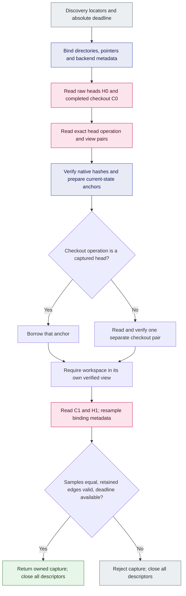

# Bounded current-state jj capture (ENG-415)

Status: accepted — maintained bounded capture API; registration and ancestry admission remain separate.

## Boundary

`operations::jj::capture::capture_current_state(&WorkspaceContext, Instant)`
connects the shared discovery locators to native baseline preparation. It reads
only the explicitly bound current heads and completed workspace checkout through
retained directory descriptors. It returns owned, immutable evidence and an
opaque sampled source binding. It opens no journal and invokes neither Git nor
jj; the API is outside Trace2 ingestion.

The reader profile remains `jj-simple-op-store/0.45.1`. This is an explicit format
contract, not detection of which jj version last wrote a repository. Capture is
implemented for Linux and macOS. Other platforms return an
unsupported error before accessing the supplied paths.

## Source and workspace binding

Discovery's public DTO is a locator hint. Capture independently checks its schema,
capability and jj kind, and opens every absolute path component from a root
anchor. Each named child-directory open uses the shared no-follow primitive with
before, opened-descriptor and after identity checks. The root anchor's descriptor
is checked separately; scan streams open relative to an already retained
directory. Raw pointer components, including `.` and `..`, are traversed rather
than lexically collapsed. Symlinks and missing
intermediate components reject capture.

Capture checks the local working-copy, Git store, simple operation store and
simple head-store markers. It binds `.jj/repo`, `git_target`, an optional Git
`gitdir:` target file, optional `commondir` and workspace `.git` presence to the
supplied source locators. A false `colocated` flag cannot hide a present Git
boundary. Git HEAD must be a regular metadata file and the common objects path
must be a directory; no Git objects or refs are interpreted.

Source equality compares the profile/backend bytes and sampled physical
identities of the jj repository, store, operation store, operations/views,
head store/heads and Git common directory. Workspace roots, working-copy
identities and raw pointer spellings are retained for this capture's validation
but excluded from shared-source equality. Linked workspaces can therefore share
one source without sharing checkout state. Equal bytes in different physical
repositories do not make the sources equal. This value is neither a durable
source ID nor a registration/continuity proof.

## Capture flow

[Rendered flowchart](../architecture/diagrams/jj-native-capture-flow.svg) and
[Mermaid source](../architecture/diagrams/jj-native-capture-flow.mmd).

Any earlier failure also rejects the capture and closes its descriptors.

The head scan retains the exact sorted raw head set, including redundant ancestor
heads. Only literal `lock` and the two dot entries are ignored; their raw scan
calls still count. Each head marker must be an empty regular file. The reader
does not scan object directories, fetch ancestors, normalize heads or reconcile
jj operations.

A checkout at a head borrows that anchor internally. An outside checkout owns
one additional operation/view pair, which never becomes a baseline anchor. In
both cases, its workspace name must exist in its own verified view. The relation
reports only head membership, without claiming ancestry, freshness or checkpoint
readiness.

`prepare_baseline()` borrows the capture's anchors without filesystem I/O.
Explicit persistence remains a separate caller action through the
[durable baseline API](2026-09-08-jj-native-baseline-persistence.md). Capture does
not choose a durable source namespace, authorize a workspace, enqueue an event,
advance applied progress or attribute dirty files.

## Fixed resource limits

| Resource | Limit |
| --- | --- |
| Raw current heads | 32 |
| Requested operation/view pairs | 32 heads plus at most one outside checkout |
| Combined raw bytes per operation/view envelope | 1 MiB |
| Retained anchor bytes | 8 MiB, including each retained shared-view copy |
| Physical regular-file read permits | 10 MiB and 192 attempts across all samples |
| Raw locator / individual component | 64 KiB / 255 bytes |
| Pointer/backend/checkout metadata file | 16 KiB |
| Retained backend, pointer and optional-entry samples | 16 |
| Directory components, edges, open attempts, live descriptors | 256 each |
| Raw directory calls | 36 per head pass, 72 overall |

The existing regular-file reader reserves payload size plus an EOF probe before
allocation and retains spent permits after failure. Capture uses one shared
budget for initial metadata, head markers, native payloads and rechecks. Directory
streams have independent offsets and count raw calls before filtering. Caps are
private fixed policy; production exposes no knobs that silently weaken them.

The absolute deadline is cooperative and checked around bounded reads, directory
operations, decoding and final validation. It cannot interrupt a blocked kernel
call. Equal boundary samples are not an atomic snapshot, do not exclude ABA and
do not certify currentness at return. A change after a file's final sample is
outside the guarantee; retained directory edges receive a final identity check.

## Qualification

Public and private APIs began with missing-only failing tests. Independent
binding and budget review found one qualification gap: replacing a directory
with a regular file rejects before the actual open. A separate missing-method
regression preceded a private static opener seam that forces a real EBADF after
valid prevalidation. It now verifies exact attempt charging, preserved I/O cause
and complete descriptor cleanup.

The final local run passed all 16 deterministic private tests and all 18 public
TestRepo cases, including two explicit jj 0.45.1 scenarios. The real cases cover
colocated dirty files and a linked checkout made stale by a rewrite from the
other workspace. The composed persistence case reopens both at-head and
outside-head captures, retains only baseline anchors, proves exact retry and
leaves observed/applied attribution progress empty. The whole fixture and
isolated home are compared around every public capture call.

The broader default jj integration set passed 236 tests (13 explicit/child lanes
ignored by that command). Twelve source/storage policy tests and 33 fork workflow
policy tests passed. Fresh build, Rust 1.93 all-target lint and final format checks
passed. Runtime qualification is local macOS with the pinned
binary recorded in the initial reader evidence. Linux raw-name behavior and
other-platform unsupported behavior run through CI; no local Windows claim is
made. Logs are retained with the `git-ai-jj-capture-` prefix. The capture flowchart
was rendered and visually inspected.

[Explicit source registration](2026-09-08-jj-native-registration.md) now composes
retained capture sessions with a published seal and the first workspace's durable
cutoff. [Registered history collection](2026-09-08-jj-native-history-collection.md) now reuses a retained session
with a separate fixed history budget to read parents to the original saved cutoff
or root; local qualification is recorded in that decision. Standalone current-state capture keeps the
limits above and does not fetch ancestors. Attachment mutation, explicit recovery,
native ancestry admission, observer integration, checkpoint ordering, rewrite
attribution and shared command behavior
remain later phases. Native jj attribution remains disabled.
