# Bounded history collection from a registered jj source

Status: accepted — implemented and locally qualified on macOS for the pinned jj profile.

Refs: [ENG-415](https://linear.app/polarcoordinates/issue/ENG-415),
[native registration](2026-09-08-jj-native-registration.md),
[pure ancestry verification](2026-09-08-jj-native-ancestry.md).

## Decision

Add `operations::jj::history::collect_registered_history` as a maintained,
read-only operations API for Linux and macOS. It takes the existing journal,
discovered workspace context, collection configuration, absolute deadline and
caller-owned SQL `ReadBudget`. It opens its own retained registered session and
returns complete native operation evidence rooted at that session's sampled
heads. Other platforms reject before policy or path access.

The owned `CollectedJjHistory` has private fields and immutable accessors:
`registration()`, `head_ids()`, `ordered_operations()`,
`reached_baseline_ids()` and `reaches_root()`. The registration supplies the
original initialization receipt, attachment and native baseline together with
fresh sampled checkout context. Output operations are native-verified and
parent-first. Exact baseline anchors are omitted from that operation vector.

This establishes historical structural closure to the saved cutoff or virtual
root. It does not establish operation newness, complete rewrite recording,
attribution readiness, or current heads at return. Reaching the virtual root is
reported explicitly, including when another branch reaches the cutoff. The
result is owned evidence, without a live descriptor lease or admission authority.

There is no new schema, journal mutation, native file write, initialization,
attachment change, observer, CLI command or Trace2 ingestion work in this slice.
The [flowchart source](../architecture/diagrams/jj-native-history-collection.mmd)
shows the complete attempt. The rendered SVG was inspected for readable labels
and the order of validation, final checks and historical output.

## Registration and sampling boundary

The coordinator requires nonempty collection opt-in before native capture.
This gate also precedes the legacy debug self-check remote exception. It uses
one history-specific retained capture session and the existing exact named seal
sample, native head/checkout sample, full policy adapter and canonical descriptor
path join. Policy loading errors deny the call.

One caller-budgeted SQL snapshot reads the source registration, its original
workspace, the selected workspace and native baseline/state. Existing joins
check the exact seal, source and workspace bindings, attachment and historical
checkout context. Native baseline operation/view hashes are verified again.
An absent or incomplete registration is unavailable; an orphan seal, individual
record or namespace-only baseline never initializes or repairs the source.

The successful two-pass raw head sample is the sole root set. Redundant heads
remain in that set. Previously returned registration values, paths, caller IDs,
checkout, change IDs, timestamps, view references and predecessor edges do not
supply roots. The saved baseline remains generation 1 and retains its original
cutoff even when sampled heads or checkout have advanced.

Saved registration-result construction borrows the capture so its retained
head evidence stays available without raw-byte cloning. Collection preserves
the capture's anchor vector and checkout indexes until final consumption.

## Complete bounded walk

The only terminals are exact saved baseline head IDs and the 64-byte zero
virtual root. Named parents of a baseline anchor do not enlarge the cutoff.
Opaque observation membership and individually verified earlier records have
no terminal authority.

The walker starts with already verified sampled head pairs. It reads an
operation/view pair only when a verified original parent edge demands that ID,
using the retained operation-store directories. Native operation decoding binds
the exact view ID; full evidence verification precedes parent expansion. Node
and remaining raw-byte admission checks precede each new read. A bounded local
map reuses shared parents and redundant roots without rereading their pairs.
Operations and views are not enumerated from their store directories.

A sampled head that is a saved terminal still consumes a read-pair slot and its
raw bytes, even though it is excluded from the pure ancestry input. A separate
own-checkout pair remains diagnostic. If a verified parent later demands it,
this first implementation deliberately rereads it once into the union and
charges both copies; checkout alone never causes that demand.

The existing iterative ancestry verifier receives exactly the reached
nonterminal evidence. It validates complete closure, missing paths, cycles,
detached input, aggregate semantic caps and deterministic parent-first order.
The collector copies only the small checked order/closure summary, releases
borrowed proofs, and retains the bounded raw evidence through final checks.

For example, a cutoff H→B does not make B a terminal. A later D→B requires B
and its remaining path to the cutoff or root. A gap rejects the entire attempt;
a root-closed late branch reports root closure without being labeled new work.

## Final checks, checkout and failure

After successful collection, the same retained session rechecks operational
metadata, the named seal and directory edges. The budget is not reset. There
is no third head scan, checkout sample or per-object existence scan. Only a
successful collection followed by a successful final recheck permits moving the
raw records into the owned result; an attempted or failed check is insufficient.
All descriptors close when the attempt returns.

If only raw heads and checkout advance after the accepted sample while other
retained metadata remains stable, the result keeps the original sampled roots.
Git HEAD is also retained metadata, so a command which changes it may separately
cause refusal. This is not an atomic snapshot, ABA defense or current-at-return
claim. Required bytes removed before reading are a gap. Bytes fully verified
and retained before later garbage collection remain usable as historical evidence.

A checkout outside the saved cutoff remains `OutsideBaseline` even when the
walk reaches its operation. `BaselineAnchor` still means exact cutoff membership,
not attribution readiness. This API does not upgrade either relation.

Timeout, native corruption, missing evidence, changed source state, incomplete
registration or a resource limit returns no partial result and changes no
native, opaque or applied progress. The attempt is one-shot. A caller retry
opens a fresh session; it does not silently enlarge limits, replace the saved
baseline or resume incomplete evidence.

## Resource bounds

| Resource | Maximum per history call |
| --- | --- |
| Sampled heads | 32 |
| Unique sampled-head/ancestor pairs | 256, including freshly sampled baseline heads |
| Original parents | 32 per operation; at most 8,192 retained edges |
| Head/ancestor raw operation plus view bytes | 8 MiB aggregate; 1 MiB per pair |
| Separate own-checkout evidence | One additional pair, at most 1 MiB |
| Nonterminal predecessor references | 4,096, including keys and repeated edges |
| Nonterminal view references | 4,096, counting each retained shared-view occurrence |
| Native metadata read permits | 10 MiB including EOF probes; 640 file attempts |
| Directory opens, components and retained edges | 256 each |
| Live scoped native filesystem descriptors | 254 directories including scan streams, one retained seal File and one transient regular reader: at most 256 |
| Head-directory calls | 36 per pass; 72 total |
| Locator and component bytes | 64 KiB per locator; 255 per component |
| SQL payloads | Existing per-record caps and the caller's cumulative encoded-BLOB `ReadBudget` |

The success-path file allowance is 512 pair reads, two separate-checkout reads,
64 head-marker reads, two checkout reads, at most 48 operational metadata reads
and two seal reads: 630 attempts within the fixed 640 cap. Failures also consume
attempts. Repeated view bytes and the separately demanded checkout copy remain
charged. Ten permits of headroom do not authorize retries or another scan.

The byte calculation is 8 MiB union evidence, 1 MiB separate checkout evidence,
768 KiB operational metadata, 32 KiB checkout samples, 2 KiB seal samples and
630 EOF probes: 10,259,062 bytes, below 10 MiB. The saved baseline can retain
another 8 MiB. These read caps are not peak allocation, SQLite-page I/O or
process-wide descriptor limits. The raw collection may be retained before final
semantic validation; semantic excess does not promise an early read cutoff.

Native capture, traversal, seal reads and storage spawn no Git or jj
processes and perform no Git object lookups. Existing policy loading is a separate explicit
stage: its cold installation lookup may spawn Git a fixed number of times and
configuration includes preserve existing I/O semantics. Native limits do not
bound policy bytes, include fanout or time. One absolute deadline is checked
cooperatively; it cannot cancel a blocked filesystem/configuration syscall or
bound every raw EINTR retry.

The complete path to the original cutoff eventually may exceed these limits.
Handling that requires a separately reviewed durable extension and generation
model. Repeated collection or serialization of this result does not create an
admission certificate. Opaque progress and baseline generation 1 remain unchanged.

## Verification

The public and private test packages were installed before production code.
After correcting a public test-helper import collision, the public suite failed
only on the absent history module; the private suite failed only on its three
absent capture APIs. These are API scaffolding RED results, not behavioral
regressions. The first runtime runs passed 22 public and 23 private cases.
A later lint correction changed one equivalent test inequality without changing
its boundary assertion.

Final local macOS qualification passed:

- 116 jj unit tests, including the 23 retained-history cases.
- 345 default jj integration tests, including the 22 public history cases;
  20 explicit/child lanes remain ignored in that default command.
- Two explicitly invoked pinned-jj history cases and two registration cases,
  covering colocated and separate-store repositories.
- 18 policy-filter cases, six internal-spawn safety checks and 33 tracked-file
  fork workflow policies.
- Fresh build, Rust 1.93 all-target Clippy and format check.

The generated fixtures and calibration report were independently reproduced
byte-for-byte: 531 operation hashes, three view hashes and exact/one-over
node, byte and semantic boundaries. Both the new history flow and the updated
registration-reopen flow were rendered and visually inspected. The retained
head buffers keep their pointers when moved into output; deterministic tests
cover changed bindings, missing ancestors, post-read garbage collection,
post-sample head/checkout movement and failed final checks.

These local results do not infer Linux or Windows runtime success. Platform CI
and feedback are tracked on the draft PR. Native admission, observer wiring,
checkpoint ordering and jj attribution remain unimplemented follow-up work.
